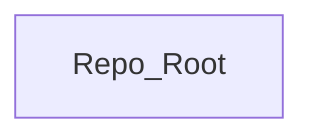

## Stack
- Not a code project (yet): repo contains only `README.md` (single line title) and `.git`.
- No manifest file (no package.json, go.mod, pyproject.toml, Cargo.toml) is present at repo root.
- No languages, frameworks, or libraries observed.

## Directory map
| path | what lives there |
|---|---|
| `/` | `README.md` (title only), `.git` (version control metadata) |

## Diagram

## Component index
- [[Repo_Root]]

## Entry points
- Dev entry point: TODO: verify (no code or manifest present)
- Prod entry point: TODO: verify (no code or manifest present)

## Conventions
- None observed — repo contains no source files to derive conventions from.

## Where things go
- To add source code, first add a manifest (package.json / go.mod / pyproject.toml / Cargo.toml) at repo root establishing the stack.
- To document the project's purpose, expand `README.md` beyond its current single-line title.
- Once code exists, re-run documentation generation to populate stack, directory map, and diagram accurately.
